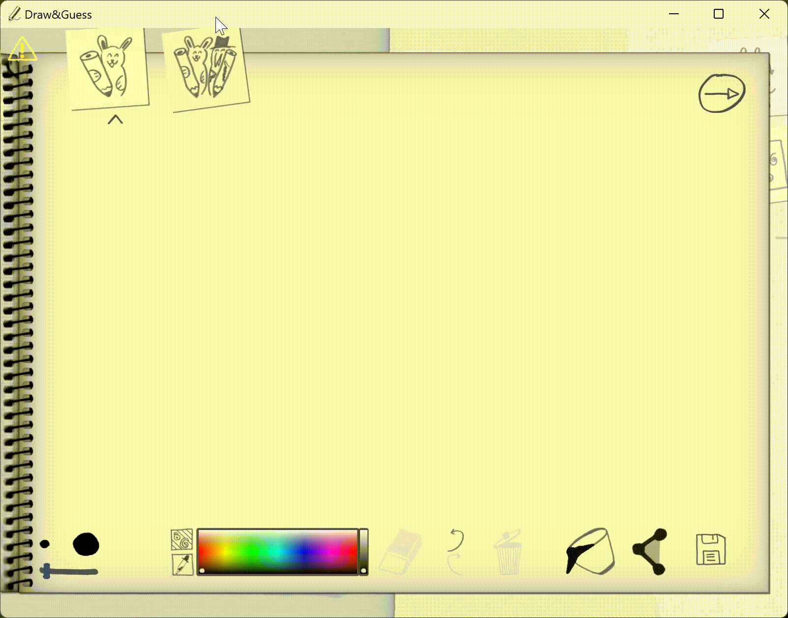

##  DrawInline - 你画我猜辅助工具

> **不是所有人都能接受脚本，建议仅在好友局中使用**
>
> 本程序仅作为数字图像处理的学习用途，无意破坏游戏乐趣

> 对于其他游戏，本工具模拟的鼠标输出可能不会被读取，可尝试使用 [DrawInline2](https://github.com/ninthseason/drawinline2)
> 
> DrawInline2 使用 [Interception](https://github.com/oblitum/Interception) 实现驱动级的鼠标控制，适用于更多场景。

三步玩转你画我猜：

1. 线稿生成器

   基于OpenCV的图像处理，由原图得到线稿

2. 笔画生成器

   利用搜索算法分析线稿，生成笔画数据

3. 鼠标自动控制

   通过笔画数据控制鼠标，实现自动绘图

### 使用指南

#### 注意事项

DrawInline 使用剪切板内的图片作为目标图片

请搭配能将图片暂存至剪切板的截图软件使用

#### 命令说明

`:threshold1` 查看当前 threshold1 值

`:threshold2` 查看当前 threshold2 值

`:threshold1 [整数]` 设置 threshold1 值

`:threshold2 [整数]` 设置 threshold2 值

threshold 参数用处详见 Canny 算法双阈值设置

`:start-point` 将当前鼠标位置设置为画板原点

将鼠标移动至画布左上角执行:start-point

`show` 显示当前剪切板图片的线稿形态

用于查看当前 threshold 的效果，以便调整 threshold

`draw` 控制鼠标，进行绘图

`quit` 退出程序

源代码及问题反馈: https://github.com/ninthseason/drawinline
